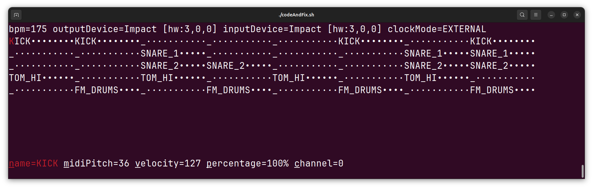

# PsyOps Tool - MIDI Looper

This is a simple JVM based MIDI Looper with a text based UI.


[Full Demo on Youtube](https://www.youtube.com/watch?v=zetXwQflREE)

## Features
- External Clock Mode: Sync to the MIDI Clock from an external MIDI device e.g. a Drum Machine.
- Internal Clock Mode: Send midi clock signals to sync with external hardware.
- Scripting: Create complex Midi Loops with kotlin based scripting.
- Odd time signatures: Create that 7/11 polyrythm and more.
- Note probabilities: Assign probabilities to notes for generative setups.

## Controls
- `w,a,s,d,←,↑,→,↓` change the current selected note.
- `v` switch to MIDI velocity display/editing mode.
- `c` switch to MIDI channel display/editing mode.
- `m` switch to MIDI pitch display/editing mode.
- `n` switch to note name display/editing mode.
- `p` switch to probability display/editing mode.

## Run
* Make sure you have a JVM>21 installed.
* Download the latest release.
* Extract the zip.
* Execute the run script:
```bash
./bin/PsyopsTool -o Impact -i Impact -c EXTERNAL --blank=4 --noteNameMask=DRUMBRUTE_IMPACT
```

## Build from source and run
- Make sure you have a JVM>21 installed.
- Clone this repository.
- Execute `./codeAndFix.sh` to compile and run the project.
